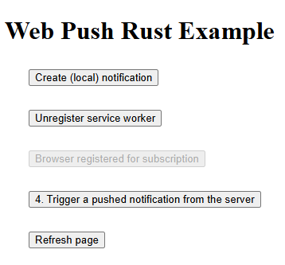
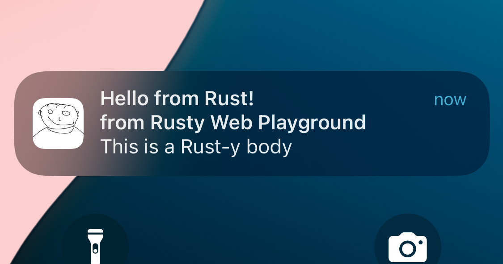
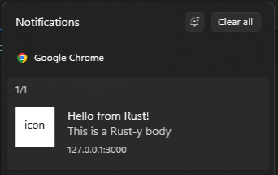

# Web Push Rust Example

Example web server using browser push notifications. Rust backend, JS. Works in an iOS progressive web app (PWA)!

## How to run

1. Clone this repository, or [](https://codespaces.new/ducklol2/web_push_rust_example).

2. From the repo root directory, generate public & private keys, which are necessary for browser web push:

```
openssl ecparam -genkey -name prime256v1 -out private_key.pem
openssl ec -in private_key.pem -pubout -outform DER|tail -c 65|base64|tr '/+' '_-'|tr -d '\n=' > static/public_key.txt
```

3. Run the server with:

```
cargo run
```

4. Visit the website - either at http://localhost:3000, or at the created URL if in a Codespace.

  > [!NOTE]
  > If on iOS, add as PWA (_Share --> Add to Home Screen_) so that notifications work.

5. Click the buttons in sequence to create local notifications, register the service worker, and then push notifications from the server

6. Visit & register with a second browser or device - a click from either will trigger notifications in both browsers!

## Screenshots







## Dependencies & recommended reading

- [Axum](https://docs.rs/axum/latest/axum), a Rust server framework
- [web-push](https://crates.io/crates/web-push), a Rust library that communicates with browser push servers
- The [web.dev Notifications documentation](https://web.dev/explore/notifications), which explains how browser push works.